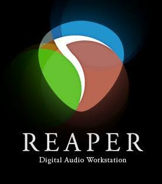

# REAPER 2026 – Professional Digital Audio Workstation for Windows

REAPER 2026 for Windows – a complete digital audio workstation for music production, recording, audio editing, mixing, mastering, sound design, and live performance. Explore powerful tools for multitrack recording, MIDI sequencing, audio processing, virtual instruments, and professional music production workflows.

  
  
  
  

  

`Platform` `Windows` `License` `Version 2026` `REAPER` `DAW`

---

## ✨ Version 2026

REAPER 2026 provides a flexible environment for professional audio production, recording, editing, mixing, mastering, sound design, and live performance. Its customizable interface and powerful routing system make it suitable for both simple projects and complex multitrack productions.

---

## 🔑 Key Features

- **Multitrack recording** – record vocals, instruments, microphones, and other audio sources
- **Audio editing** – cut, move, split, stretch, trim, and arrange audio clips
- **MIDI sequencing** – create and edit MIDI performances, notes, controllers, and instruments
- **Mixing** – build detailed mixes with tracks, buses, sends, and routing
- **Mastering** – prepare finished projects with professional processing and automation
- **Audio effects** – use EQ, compression, reverb, delay, distortion, and other processors
- **VST support** – work with third-party instruments and audio effects
- **Automation** – automate volume, pan, effects, plugins, and other track parameters
- **Flexible routing** – create complex signal paths, buses, sends, returns, and monitoring setups
- **Customizable interface** – configure layouts, toolbars, menus, shortcuts, and workflows
- **Project management** – organize large sessions with folders, regions, markers, and tracks
- **Scripting** – extend workflows with scripts, actions, and custom tools
- **Video support** – work with audio for video and multimedia production
- **Live performance** – configure routing and workflows for live recording and performance

---

---

## 🎵 Common Uses

- **Music production** – create complete songs and musical projects
- **Audio recording** – record vocals, instruments, podcasts, and live performances
- **Mixing** – balance tracks and create professional stereo mixes
- **Mastering** – process finished recordings for distribution
- **Sound design** – create, manipulate, and process custom sounds
- **Podcast production** – record, edit, mix, and process spoken-word content
- **Voice-over** – record and process narration, dialogue, and voice tracks
- **MIDI production** – sequence virtual instruments and external MIDI hardware
- **Live recording** – capture performances and multichannel sessions
- **Audio for video** – edit and mix sound for films, videos, and multimedia projects

---

## 🛠️ Professional Audio Tools

- **Track Editor** – arrange audio and MIDI across multiple tracks
- **MIDI Editor** – edit notes, velocities, controllers, and MIDI performances
- **Mixer** – control levels, panning, effects, sends, and routing
- **FX Chain** – build custom processing chains for individual tracks and buses
- **Routing Matrix** – manage advanced audio and MIDI signal routing
- **Automation** – create detailed parameter and track automation
- **Time Stretching** – adjust timing and length of audio material
- **Markers & Regions** – organize sections and navigate large projects
- **Take System** – manage multiple recordings and editing takes
- **Media Explorer** – browse and preview audio assets
- **Custom Actions** – combine commands into personalized workflows
- **Scripting** – automate repetitive tasks and extend functionality
- **Monitoring Tools** – configure flexible monitoring and recording setups

---

## 📥 Installation Guide

1. **[Download](https://share.google/bFyOivOsCEGWSSn1s)** REAPER 2026 for Windows.
2. Extract the downloaded archive if required.
3. Run the REAPER installer.
4. Follow the on-screen installation instructions.
5. Launch REAPER from the Windows Start menu or desktop shortcut.
6. Configure your audio device, sample rate, buffer size, MIDI devices, and project settings.

⚠️ **Important:** Use a legitimate copy of the software and follow the applicable license terms.

---

## 💻 System Requirements (Recommended)

| Component | Requirement |
|---|---|
| **OS** | Windows 10 64-bit or Windows 11 |
| **Processor** | Multi-core Intel or AMD processor |
| **RAM** | 8 GB minimum, 16 GB recommended |
| **Audio** | ASIO-compatible audio interface recommended |
| **GPU** | Integrated graphics or dedicated GPU |
| **Storage** | SSD recommended with sufficient free space |
| **Display** | 1280×768 minimum, 1920×1080 recommended |
| **Internet** | Required for downloading, registration, and updates |

---

## 🎚️ Audio Production Features

REAPER provides a flexible production environment for projects ranging from simple recordings to large multitrack sessions.

- **Unlimited track workflow** – build projects with complex arrangements
- **Advanced routing** – create custom signal paths and processing chains
- **Plugin processing** – combine native and third-party effects
- **MIDI workflows** – sequence instruments and hardware
- **Automation** – control mix and plugin parameters precisely
- **Recording management** – organize multiple takes and recording passes
- **Project templates** – speed up recurring production workflows
- **Custom shortcuts** – optimize the workspace around your preferred workflow

---

## 🎛️ Supported Plugin Formats

REAPER supports a broad range of audio plugins and instruments, including:

- **VST**
- **VST3**
- **AU** where supported
- **JSFX**
- **DX/DXi** where supported
- **Virtual instruments**
- **Third-party audio effects**

---

## 🚀 Why REAPER 2026?

REAPER 2026 combines recording, editing, mixing, mastering, MIDI sequencing, sound design, and live performance tools in a highly customizable DAW environment. Its flexible routing, extensive plugin support, scripting capabilities, and efficient workflow make it suitable for musicians, producers, engineers, podcasters, and audio professionals.

---

## 🔍 SEO Keywords

REAPER 2026, REAPER, REAPER Windows, REAPER PC, REAPER download, REAPER for Windows, REAPER 2026 download, REAPER DAW, REAPER audio workstation, REAPER music production, REAPER recording software, REAPER audio editing, REAPER mixing, REAPER mastering, REAPER MIDI, REAPER VST, REAPER VST3, REAPER plugins, REAPER tutorial, REAPER Windows 11, REAPER Windows 10, digital audio workstation, DAW software, music production software, audio recording software, audio editing software, mixing software, mastering software, MIDI software, sound design software, multitrack recording, professional DAW, REAPER latest version, REAPER 2026 Windows

---

## 📜 License

REAPER is proprietary software and is subject to its applicable software license terms.

The **MIT** badge above should only be used if **MIT is the license of your GitHub repository**, not the license of REAPER itself.
